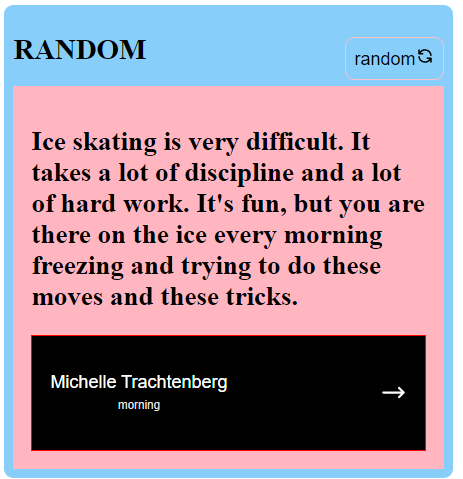
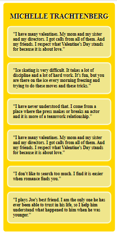

# Random Quote Generator in React

## Structure

I created an app file to handle the router and switch element so that you can link over the quotes. The users can click the random button in order to get the another quote. There is another file for the button from the link of the author's name so when the user press the button, they can get more quotes of the author that is in the button.

1- First seight 



2- After clicking the button link



## Source: 

These are the source of this project.

API: https://pprathameshmore.github.io/QuoteGarden/

Icon: https://google.github.io/material-design-icons/

Figma: 

[Check the design link here](https://www.figma.com/file/FFxqnf1cEDiHhvFpN6u4hV)

As long as I fulfill all the user needed, I gave my personal touches by adding transition, changing colors, or even creating my own layout,...

## What have you learned/improved 

I learned many things from this design. 
- I learned how to link a file from another file in react.
- I learned how to use router, swicth and route even having the useParams. 
- I learned the use of many apis at once 

### Built With
I built it with react [React](https://reactjs.org/) hooks

## How To Use

To clone and run this application, you'll need [Git](https://git-scm.com) and [Node.js](https://nodejs.org/en/download/) (which comes with [npm](http://npmjs.com)) installed on your computer. From your command line:

```bash
# Clone this repository
$ git clone https://github.com/your-user-name/your-project-name

# Install dependencies
$ npm install

# Run the app
$ npm start
```


## Contact

-   Website [your-website.com](https://quotes-randomely.netlify.app/)

-   GitHub [@Peta Jeannie](https://github.com/tiaraha-funny/)

-   Email: mailto:peta.jea@onja.org
